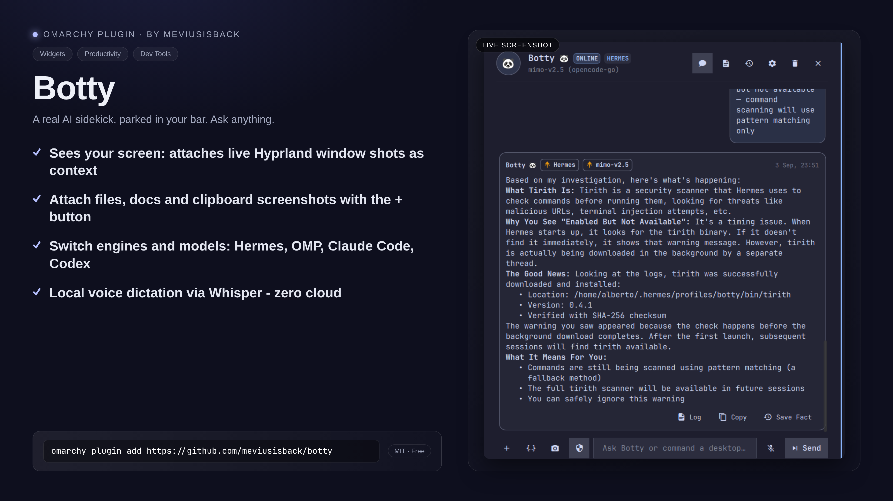

# Botty — Omarchy Desktop Agent Assistant Bar Widget

**Botty** is an interactive, native Omarchy bar widget and desktop assistant powered by the Hermes Agent profile `botty`, with support for OMP, Claude Code, and Codex. It integrates directly into your top bar to provide instant ambient screen awareness, universal file & document context, persistent memory, continuous learning, model switching, and desktop automation actions.



---

## ✨ Features

- 🐼 **Native Omarchy Bar Widget**: Status-aware bar icon that indicates live state:
  - **Ready / Done**: Steady Panda glyph (`🐼`) in theme foreground.
  - **Thinking / Processing**: Animated pulsing spinner (`󰑐`) in accent blue.
  - **Prompt / Waiting**: Amber lightbulb / prompt indicator (`󰌵`).
  - **Error / Alert**: Urgent red glyph (`󰅚`).
- 󰹑 **Ambient Visual Screen Awareness**: Captures active Hyprland windows and attaches visual screenshots directly for multimodal models (zero raw OCR dump clutter).
- 󰐕 **Universal File & Context Attachments (`+`)**:
  - **Consolidated `+` Button**: Attach any code file (`.py`, `.js`, `.rs`, `.json`, `.toml`, etc.), document (`.pdf`, `.docx`, `.md`, `.txt`, `.csv`), or media file directly into your prompt.
  - **Floating Native File Chooser**: Automatically floats and centers on top of the widget without disturbing your tiling window layout.
  - **Right-Click Clipboard Paste**: Right-click `+` to instantly attach a screenshot from your clipboard.
- 🎙️ **Voice Dictation**: Click `󰍬` next to Send to record audio with PipeWire and transcribe locally via `voxtype` (Whisper).
- 󰒓 **Multi-Agent & Model Switching**:
  - **Agent Engine Switcher**: Toggle between **Hermes Agent (Botty)**, **OMP (Oh My Pi)**, **Claude Code**, and **OpenAI Codex**.
  - **Active Provider Filter**: Shows only configured inference providers with populated API keys (`OpenCode Go`, `OpenRouter`, `Ollama Local`, etc.).
  - **Searchable Model Catalog**: Browse and switch among hundreds of models with real-time config synchronization.
- 󰋚 **Continuous Learning, Memory Management & Encryption**:
  - **Single-Click Memory Deletion**: Delete and cancel stored facts directly from the `󰋚 Memories` tab.
  - **Local AES-256 Memory Vault**: Hardware-bound PBKDF2 encrypted vault backup with owner-only `0600` POSIX permission isolation.
- 󰘦 **Desktop Automation Actions**: Runs terminal commands, manages files, and interacts with Hyprland and system apps.

---

## ⌨️ Global Keyboard Shortcuts

Configured in `~/.config/hypr/bindings.lua`:

| Shortcut | Action | Description |
|---|---|---|
| **`SUPER + A`** | **Toggle Botty** | Opens/closes Botty and auto-focuses the chat input immediately. |
| **`SUPER + SHIFT + A`** | **Ask with Window Context** | Captures the active window screenshot, attaches it as visual context, opens Botty, and focuses the chat input for typing. |

---

## 🚀 Installation & Window Rules

### 1. Link Plugin to Omarchy

```bash
mkdir -p ~/.config/omarchy/plugins
ln -s ~/repo/botty ~/.config/omarchy/plugins/meviusisback.botty
```

### 2. Configure Floating File Dialogs in Hyprland

Add to your `~/.config/hypr/hyprland.lua`:

```lua
-- Float, center, and size file dialogs on top of the widget
o.window({ title = ".*Attach File.*" }, { float = true, center = true, size = { 740, 500 }, stay_focused = true })
o.window({ title = ".*(Open File|Select File|Choose File|Open Folder|Save File).*" }, { float = true, center = true, size = { 740, 500 }, stay_focused = true })
o.window("xdg-desktop-portal.*", { float = true, center = true, size = { 740, 500 } })
```

### 3. Reload Omarchy Shell & Hyprland

```bash
hyprctl reload
omarchy restart shell
```

### Request timeout

Botty allows long-running agent requests to complete before reporting a timeout.
The default request timeout is **600 seconds**. Override it in Botty's existing
JSON configuration file at `~/.local/share/botty/config.json`:

```json
{
  "request_timeout_seconds": 900
}
```

The value is a positive number of seconds. Invalid or non-positive values use
the 600-second default. Other Botty configuration keys may be kept alongside
this setting.

---

## 📄 License

MIT License © 2026 meviusisback
