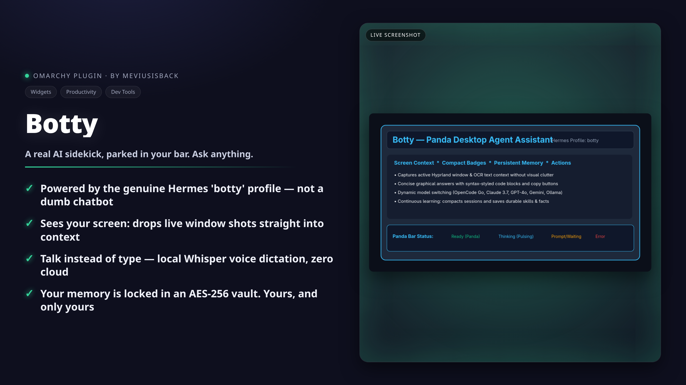

# Botty — Omarchy Desktop Agent Assistant Bar Widget



**Botty** is an interactive, native Omarchy bar widget and desktop assistant powered by the Hermes Agent profile `botty`, with support for OMP, Claude Code, and Codex. It integrates directly into your top bar to provide instant ambient screen awareness, universal file & document context, persistent memory, continuous learning, model switching, and desktop automation actions.

---

## ✨ Features

- 🐼 **Native Omarchy Bar Widget**: Status-aware bar icon that indicates live state:
  - **Ready / Done**: Steady Panda glyph (`🐼`) in theme foreground.
  - **Thinking / Processing**: Animated pulsing spinner (`󰑐`) in accent blue.
  - **Prompt / Waiting**: Amber lightbulb / prompt indicator (`󰌵`).
  - **Error / Alert**: Urgent red glyph (`󰅚`).
- 󰹑 **Ambient Visual Screen Awareness**: Captures active Hyprland windows and attaches visual screenshots directly for multimodal models (zero raw OCR dump clutter).
- 󰐕 **Universal File & Context Attachments (`+`)**:
  - **Consolidated `+` Button**: Attach any code file (`.py`, `.js`, `.rs`, `.json`, `.toml`, etc.), document (`.pdf`, `.docx`, `.md`, `.txt`, `.csv`), or media file directly into your prompt.
  - **Floating Native File Chooser**: Automatically floats and centers on top of the widget without disturbing your tiling window layout.
  - **Right-Click Clipboard Paste**: Right-click `+` to instantly attach a screenshot from your clipboard.
- 🎙️ **Voice Dictation**: Click `󰍬` next to Send to record audio with PipeWire and transcribe locally via `voxtype` (Whisper).
- 󰒓 **Multi-Agent & Model Switching**:
  - **Agent Engine Switcher**: Toggle between **Hermes Agent (Botty)**, **OMP (Oh My Pi)**, **Claude Code**, and **OpenAI Codex**.
  - **Active Provider Filter**: Shows only configured inference providers with populated API keys (`OpenCode Go`, `OpenRouter`, `Ollama Local`, etc.).
  - **Searchable Model Catalog**: Browse and switch among hundreds of models with real-time config synchronization.
- 󰋚 **Continuous Learning, Memory Management & Encryption**:
  - **Single-Click Memory Deletion**: Delete and cancel stored facts directly from the `󰋚 Memories` tab.
  - **Local Memory Vault Backup**: AES-256 encrypted backup copy with an obfuscation-grade machine-derived key. The real protection is owner-only `0600`/`0700` POSIX permissions — source memories and chat history remain plaintext on disk; do not treat the vault as confidentiality.
- 󰘦 **Desktop Automation Actions**: Runs terminal commands, manages files, and interacts with Hyprland and system apps.

---

## ⌨️ Global Keyboard Shortcuts

Botty registers the IPC handlers, but the keybinds live in your Hyprland
bindings file (e.g. `~/.config/hypr/bindings.lua` on Omarchy). Add:

```lua
o.bind("SUPER + A", "Toggle Botty", "omarchy-shell -q meviusisback.botty toggle")
o.bind("SUPER + SHIFT + A", "Botty with window context", "omarchy-shell -q meviusisback.botty situationContext")
```

| Shortcut | Action | Description |
|---|---|---|
| **`SUPER + A`** | **Toggle Botty** | Opens/closes Botty and auto-focuses the chat input immediately. |
| **`SUPER + SHIFT + A`** | **Ask with Window Context** | Captures the active window screenshot, attaches it as visual context, opens Botty, and focuses the chat input for typing. |

---

## 🚀 Installation & Window Rules

### 1. Prerequisite: a Hermes profile named `botty`

Botty drives the Hermes Agent CLI (`hermes`) using a profile named `botty` —
without it, the engine shows as unavailable. If you don't have one yet:

```bash
hermes profile create botty
```

Install the engine's own tools (`hermes`, plus `ffmpeg`, `grim`, `wl-clipboard`,
`openssl` for the vault backup) and, for voice dictation, `voxtype` with a
local Whisper model.

### 2. Install the Plugin

```bash
omarchy plugin add https://github.com/meviusisback/botty --enable
```

Omarchy clones the plugin into `~/.config/omarchy/plugins/meviusisback.botty/`
and enables the bar widget.

### 3. Optional Keybinds & Floating File Dialogs

Add to your Hyprland bindings file (e.g. `~/.config/hypr/bindings.lua`):

```lua
o.bind("SUPER + A", "Toggle Botty", "omarchy-shell -q meviusisback.botty toggle")
o.bind("SUPER + SHIFT + A", "Botty with window context", "omarchy-shell -q meviusisback.botty situationContext")
```

Add to your `~/.config/hypr/hyprland.lua` to float, center, and size file
dialogs on top of the widget:

```lua
o.window({ title = ".*Attach File.*" }, { float = true, center = true, size = { 740, 500 }, stay_focused = true })
o.window({ title = ".*(Open File|Select File|Choose File|Open Folder|Save File).*" }, { float = true, center = true, size = { 740, 500 }, stay_focused = true })
o.window("xdg-desktop-portal.*", { float = true, center = true, size = { 740, 500 } })
```

### 4. Reload Omarchy Shell & Hyprland

```bash
hyprctl reload
omarchy restart shell
```

### Request timeout

Botty allows long-running agent requests to complete before reporting a timeout.
The default request timeout is **600 seconds**. Override it in Botty's existing
JSON configuration file at `~/.local/share/botty/config.json`:

```json
{
  "request_timeout_seconds": 900
}
```

The value is a positive number of seconds. Invalid or non-positive values use
the 600-second default. Other Botty configuration keys may be kept alongside
this setting.

---

## 🧹 Removal

```bash
omarchy plugin remove meviusisback.botty
```

This removes the plugin from the bar and deletes
`~/.config/omarchy/plugins/meviusisback.botty/`. To also wipe Botty's own data
(chat history, memories, captures), remove:

```bash
rm -rf ~/.local/share/botty
```

Your Hermes profile (`~/.hermes/profiles/botty`) is a separate Hermes resource
and is not touched by the plugin; remove it manually if you want a full purge.

---

## 📦 Requirements

**Runtime (required by the default Hermes engine):**

| Dependency | Purpose |
|---|---|
| Omarchy (Hyprland + Quickshell shell) | The host desktop this widget runs in |
| [`hermes`](https://github.com/NousResearch/hermes-agent) CLI | The agent engine behind the default profile |
| A Hermes profile named `botty` (`hermes profile create botty`) | Botty's agent profile, memory, and skills |
| `grim` | Screenshot capture for visual screen context |
| `wl-clipboard` (`wl-copy`/`wl-paste`) | Clipboard image attach and copy-out |
| `openssl` | AES-256 vault backup |
| `ffmpeg` (PulseAudio/PipeWire input) | Voice dictation recording |

**Optional engines (switch in Settings):** `omp` (Oh My Pi), `claude` (Claude Code), `codex` (OpenAI Codex).

**Optional voice:** [`voxtype`](https://github.com/NousResearch/voxtype) with a local Whisper model.

Non-Omarchy Hyprland setups work if the above binaries exist, but the widget's
notifications and summons rely on Omarchy's shell helpers (`omarchy-shell`,
`omarchy-notification-send`).

---

## 🔐 Security Model

**Sandbox Mode is best-effort prompt-level guidance, not a security boundary.**
The underlying agent runs with tool-approval prompts bypassed (`--yolo`), so it
can technically execute anything its engine allows. In Sandbox Mode Botty is
*instructed* to halt before writes and show an approval card; in-chat approvals
are advisory. Do not rely on this as containment against a compromised or
prompt-injected agent.

**Memory Vault is an obfuscation-grade backup, not confidentiality.** The vault
key is derived from publicly readable machine identifiers, and the vault is a
redundant copy — source memories and chat history stay plaintext on disk. The
actual access control is owner-only POSIX permissions (`0600` files, `0700`
dirs) under `~/.local/share/botty`.

---

## 📄 License

MIT License © 2026 meviusisback
